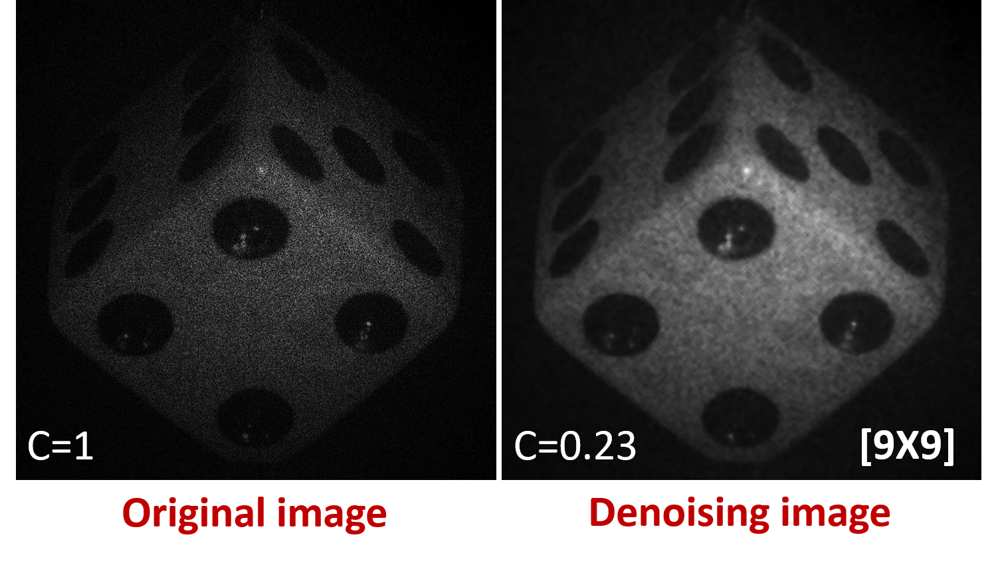

## Hybrid Median-mean method to reduce speckle noise
### Fast and powerful denoising strategy for reducing the speckle noise. 

We present a single-shot computational method based on the use of a hybrid median-mean approach for reducing the speckle noise. The proposed method can be applied to both amplitude and phase reconstructed images. This method is based on the combination of multiple median-filtered images with different kernel sizes. Because, for each median-filtered image the speckle position changes, the average of these median-filtered images results in a final image with low speckle contrast and no resolution decrease (e.g., no blurring effect introduced by the median filter). The proposed method has been evaluated experimentally in digital holography and digital holographic microscopy. 

<p align="center">

</p>

### Scripts
After publications of this method, both MATLAB and Python scripts will be freely available. 
The **hybrid median-mean method** has five parameters for both enviroments MATLAB and PYthon:

- **image**: Corresponds to the noise image. 
- **max_kernel_size**: The maximun dimension of the kernel, this number must be odd. 
- **figures**: Allow to show the original/noise image (named as *image*) and the denoising image after applied the hybrid median-mean approach; Figures has two options: *True* for displaying both images or *False* for not displaying.  
- **plots**: Allow to select a square region to measure/quantify the speckle contrast and plot the speckle contrast vs number of iterations; Plots has two options *True* or *False*.
- **save_image**: Allow to save the final denoising image after applying the hybrid median-mean method; Save_image has two options *True* or *False*.

### MATLAB script
 Below there is an example for running the hybrid median-mean method in MATLAB:
 
```markdown
# call the script 
[denoising] = hybrid_median_mean(image, max_kernel_size, figures='True', plots ='True', save_image='True')
```

### Python script
 Below there is an example for running the hybrid median-mean method in Python:
 
```markdown
# import library
import HMM

# call the function HHM_UofM.HMM
HMM.HybridMedianMean(image, max_kernel_size, figures='True', plots ='True', save_image='True')
```

### Dowloads
* [HMM-MATLAB](https://drive.google.com/file/d/1THG9zeWnvH8xEJ0GoqGsJ3jvvAXtc3AS/view?usp=sharing)

* [HMM-Python](https://drive.google.com/file/d/1OMfWdNFn0yRrQ8LEu5RoW_duI3dLejkZ/view?usp=sharing) 

### Acknowledgments
R. Castaneda and A. Doblas acknowledge the support from the University of Memphis and the Herff College of Engineering.

### Citation
We appreciate your citation if using hybrid median-mean method for publication:

* R. Castaneda, J. Garcia-Sucerquia and A. Doblas, “Speckle Noise Reduction in Digital Holography via a Hybrid Median-Mean Approach,” Appl. Opt, under review (2021).

### Support or Contact

| Researcher  | email | Google Scholar | ResearchGate |
| ------------- | ------------- |-------------| -------------|
| Raul Castaneda | *rcstdq@memphis.edu* | [RaulGoogle](https://scholar.google.com/citations?user=RBtkL1oAAAAJ&hl=en) | [RaulResearch](https://www.researchgate.net/profile/Raul_Castaneda_Quintero)
| Ana Doblas| *adoblas@memphis.edu* | [AnaGoogle](https://scholar.google.es/citations?user=PvvDEMYAAAAJ&hl=en) | [AnaResearch](https://www.researchgate.net/profile/Ana_Doblas2) |
